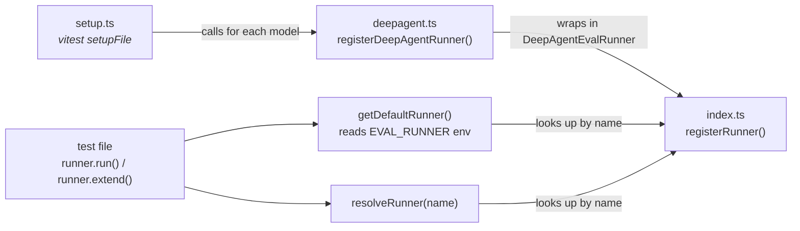

# @deepagents/evals

Generic eval harness for `deepagents`. Provides the runner interface,
runner registry, trajectory parsing, and custom vitest matchers with
LangSmith feedback integration.

## Package exports

| Export | Description |
| --- | --- |
| `@deepagents/evals` | Core harness — `EvalRunner`, registry functions, `parseTrajectory`, `getFinalText`, custom matchers |
| `@deepagents/evals/deepagent` | `registerDeepAgentRunner()` — wires `createDeepAgent` into the generic runner interface |
| `@deepagents/evals/setup` | Side-effect import that registers all concrete runners (sonnet-4-5, gpt-4.1, etc.) |

## Core concepts

### `EvalRunner`

The central interface. A runner has a `name`, a `run()` method, and an
`extend()` method:

```ts
interface EvalRunner {
  name: string;
  run(params: RunAgentParams): Promise<AgentTrajectory>;
  extend(overrides: Record<string, unknown>): EvalRunner;
}
```

- **`run()`** takes invocation params only — `{ query, initialFiles? }`.
- **`extend()`** returns a new runner with agent configuration overrides
  (e.g. `systemPrompt`, `tools`, `subagents`) baked in. This keeps
  "what the agent is" separate from "what to ask it".

### `RunAgentParams`

```ts
interface RunAgentParams {
  query: string;
  initialFiles?: Record<string, string>;
}
```

Pure invocation inputs. `query` is the user message; `initialFiles` seeds the
agent's virtual file system.

### `AgentTrajectory`

```ts
interface AgentTrajectory {
  steps: AgentStep[];
  files: Record<string, string>;
}
```

The output of every `run()` call. `steps` is an ordered list of agent
turns (each containing an `AIMessage` action and any `ToolMessage`
observations). `files` is the final file-system snapshot.

### Runner registry



1. **`setup.ts`** is loaded as a vitest `setupFile`. It calls
   `registerDeepAgentRunner()` for each model, which internally calls
   `registerRunner()`.
2. **`getDefaultRunner()`** reads the `EVAL_RUNNER` env var, looks up the
   runner by name, and returns it (cached).
3. **`resolveRunner(name)`** is the lower-level lookup if you need a
   specific runner by name.

### `registerDeepAgentRunner`

Bridges `createDeepAgent` to the generic `EvalRunner` interface:

```ts
registerDeepAgentRunner("sonnet-4-5", (config) =>
  createDeepAgent({
    ...config,
    model: new ChatAnthropic({ model: "claude-sonnet-4-5-20250929" }),
  }),
);
```

The factory receives optional overrides (from `extend()`) and must return
an invokable agent. A default agent (no overrides) is built eagerly at
registration time and reused across `run()` calls for performance.
When `extend()` is called, a fresh agent is constructed with the overrides.

The `DeepAgentEvalRunner` handles:
- Converting `initialFiles` strings into the `FileData` format expected
  by the agent's state backend
- Generating a unique `thread_id` per invocation
- Calling `ls.logOutputs()` for LangSmith experiment tracking
- Parsing the raw LangGraph result into an `AgentTrajectory`

## Custom vitest matchers

Imported automatically when you import from `@deepagents/evals`.
Each matcher also logs LangSmith feedback (scores) so results appear in
the experiment dashboard.

| Matcher | Description |
| --- | --- |
| `toHaveAgentSteps(n)` | Trajectory has exactly `n` steps |
| `toHaveToolCallRequests(n)` | Total tool-call count equals `n` |
| `toHaveToolCallInStep(step, match)` | Step (1-indexed) contains a tool call matching `{ name, argsContains?, argsEquals? }` |
| `toHaveFinalTextContaining(text, caseInsensitive?)` | Last step's text content includes `text` |

## Adding a new runner

To add support for a new model, add a `registerDeepAgentRunner` call in
`src/setup.ts`:

```ts
registerDeepAgentRunner("my-model", (config) =>
  createDeepAgent({ ...config, model: new ChatMyProvider({ model: "my-model" }) }),
);
```

Then run evals with `EVAL_RUNNER=my-model`.

To add a completely different runner backend (not deepagents), implement
the `EvalRunner` interface directly and call `registerRunner()`, or use
the runner directly inside of the eval suite.

## Development

```bash
pnpm build       # Build with tsdown
pnpm typecheck   # Type-check without emitting
```
